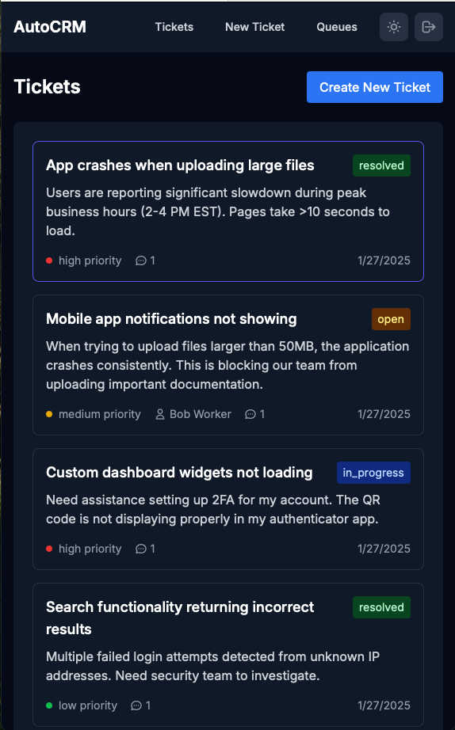
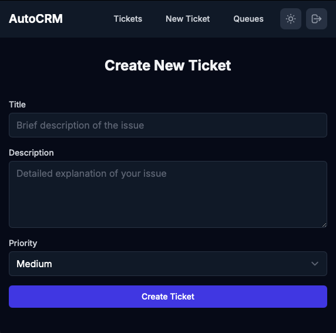

# AutoCRM

A modern customer relationship management system built with Next.js and Supabase, designed for efficient ticket management and customer support.

## Features

- 🎫 **Ticket Management**: Create, track, and manage support tickets with customizable queues and states
- 👥 **Role-Based Access**: Separate interfaces for customers, workers, and administrators
- 💬 **Conversation Threading**: Threaded conversations for each ticket
- 🔒 **Secure Authentication**: Powered by Supabase Auth
- 📱 **Responsive Design**: Modern UI that works seamlessly across all devices
- 📊 **Dashboard Analytics**: Track ticket metrics and team performance
- 🔍 **Advanced Search**: Full-text search across tickets and conversations

## Project Structure

```
├── frontend/           # Next.js frontend application
├── backend/           # Python backend for additional services
├── supabase/         # Supabase configurations and migrations
├── scripts/          # Utility scripts for development
└── docs/            # Project documentation
```

## Getting Started

### Prerequisites

- Node.js 18+
- npm or yarn
- Supabase CLI
- Python 3.9+ (for backend services)

### Local Development Setup

1. Clone and install dependencies:
```bash
git clone https://github.com/yourusername/AutoCRM.git
cd AutoCRM
cd frontend && npm install
```

2. Set up environment variables:
```bash
cp .env.example .env.local
```

Required environment variables:
```
NEXT_PUBLIC_SUPABASE_URL=your_supabase_url
NEXT_PUBLIC_SUPABASE_ANON_KEY=your_supabase_anon_key
SUPABASE_SERVICE_KEY=your_service_key  # For admin operations
```

3. Start Supabase locally:
```bash
supabase start
```

4. Run migrations:
```bash
supabase migration up
```

5. Start the development server:
```bash
npm run dev
```

Visit [http://localhost:3000](http://localhost:3000) to see the application.

## Development Guidelines

- All sensitive information must be stored in environment variables
- Pre-commit hooks are in place to prevent committing sensitive data
- Follow the established code style and TypeScript conventions
- Write tests for new features

## Testing

```bash
# Run frontend tests
cd frontend && npm test

# Run E2E tests
npm run test:e2e
```

## Screenshots


*Ticket management interface*


*Create new support tickets*

## Contributing

1. Fork the repository
2. Create your feature branch
3. Commit your changes (ensure pre-commit hooks pass)
4. Push to the branch
5. Create a Pull Request

## License

This project is licensed under the MIT License - see the LICENSE file for details.
